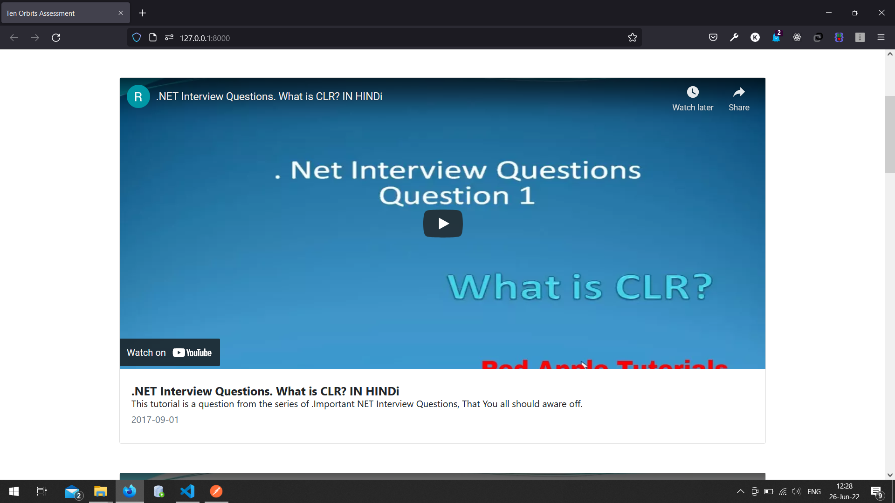

# YouTube Playlist using PlaylistItems API by Google

This project has been developed in and as an assessment given by Ten Orbits and taken by Kiran Shrestha.
The data in the app is supplied by Youtube PlaylistItems API.

## Environment Variables

To run this project, you will need to add the following environment variables to your .env file

`DEVELOPER`: `'Kiran Shrestha'`

`API_BASE_URL`: `https://youtube.googleapis.com/youtube/v3/playlistItems`

`PART`:`snippet`

`PLAYLIST_ID`: `ANY_PLAYLIST_ID`

`API_AUTH_KEY`: `Needs to be generated in Google Cloud Console`

## Project Images
`Playlist View 1`

`Playlist View 2`

`Playlist View 3`

`Playlist View 4`

`Video in Popup 1`

`Video in Popup 1`

## Authors

- [@ikiranshrestha](https://github.com/ikiranshrestha)

